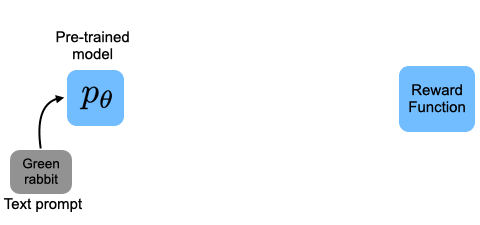

# Codebase adapted from the official [DPOK: Reinforcement Learning for Fine-tuning Text-to-Image Diffusion Models](https://arxiv.org/abs/2305.16381) codebase - [official repository] (https://github.com/google-research/google-research/tree/master/dpok).



## Env Installation

We recommend the Anaconda version Anaconda3-2022.10.

```bash
wget -P /tmp https://repo.anaconda.com/archive/Anaconda3-2022.10-Linux-x86_64.sh
bash /tmp/Anaconda3-2022.10-Linux-x86_64.sh
conda init bash
source ~/.bashrc
```

Create a conda environment and install required modules.

```bash
conda env create -f environment.yaml
conda activate dpok
```

Install ImageReward module.

```bash
bash install_image_reward.sh
```

If training gets stuck, try uninstall torch_xla and reinstall accelerate:

```bash
pip uninstall torch_xla
pip uninstall accelerate
pip install accelerate==0.17.0
```

## Training

### For a single prompt

```bash
accelerate launch train_online_pg.py --p_batch_size 4 --reward_weight 10 --kl_weight 0.01  --learning_rate 1e-5 --single_flag 1 --single_prompt "A green colored rabbit." --gradient_accumulation_steps 12 --clip_norm 0.1 --g_batch_size 10 --multi_gpu 0 --v_flag 1
```

Explanation of the arguments:
- `p_batch_size`: batch size for policy training. Batch size 4 can be used for a single A100 GPU. If multiple GPUs are used, we need to share the entire unet which is more memory-consuming. In this case, we need to use a smaller batch size for policy training (2 for each A100).
- `reward_weight`: weight for the reward term in the policy loss
- `kl_weight`: weight for the KL term in the policy loss
- `learning_rate`: learning rate for the policy network
- `single_flag`: whether to train on a single prompt
- `single_prompt`: the single prompt to train on
- `gradient_accumulation_steps`: number of gradient accumulation steps
- `clip_norm`: gradient clipping norm
- `g_batch_size`: batch size for generation. Batch size 12 can be used for a single A100 GPU.
- `multi_gpu`: whether to use multiple GPUs.
- `v_flag`: whether to use value learning.

The LoRA weights and tensorboard logs will be saved under `./online_model/img_reward_0/pre_train/single_prompt/prompt_name`.

### For multiple prompts

```bash
accelerate launch train_online_pg.py --p_batch_size 2 --reward_weight 1000 --kl_weight 0.1  --learning_rate 1e-5 --single_flag 0 --prompt_path ./dataset/drawbench/data_meta.json --gradient_accumulation_steps 12 --clip_norm 0.1 --g_batch_size 6 --multi_gpu 1 --max_train_steps 100000 --v_flag 1
```

For the format of the prompt dataset, please refer to `./dataset/drawbench/data_meta.json` as an example. 

## Test
Put the lora weights under `./test`, and run `test.py --prompt "A green colored rabbit."`. One can modify the test prompt and model path as needed in the arguments.
