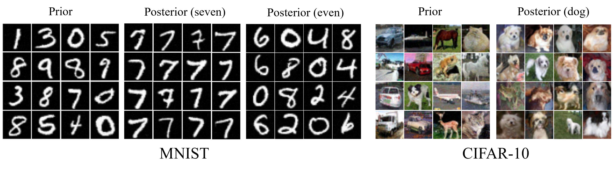

# Amortizing intractable inference in diffusion models for vision, language, and control
Code to finetune a Diffusion posterior from an unconditional diffusion prior. The code base was written to be compatible with the Diffusers library, from HuggingFace.




## File Structure

- `src/`: Contains all the source code.
  - `src/models`: Code for denoising and diffusion models.
    - `src/models/pretrained/`: Should contain pretrained weights.
  - `src/utils/`: Custom utility libraries.
  - Code to run experiments.
- `results/`: Stores local results (can be redirected).


### Training a Prior Model Locally
Train a prior model locally using `train_prior.py`. The results will be in saved in `./results/` folder unless the `--save_folder` argument is set. 

### Fine-Tuning a Pretrained Model

To finetune you must run the `finetune_posterior.py` file. Remember to substitute `PATH-TO-DATA` and `PATH-TO-RESULTS`. The supported datasets and `mnist` and `cifar-10`. For each, the prior model to use has already been hardcoded in our library, and will be automatically retrieved from the hugging face database. Should you want to try other prior models this can be done. Note, for best results, use prior models trained with large variance scheduling.
##### Example Command
```bash
python ../finetune_posterior.py --data_path PATH-TO-DATA --save_folder PATH-TO-RESULTS \
                                --load_path ./../models/pretrained --dataset mnist --lr 6e-4 \
                                --sampling_length 100 --batch_size 32 --accumulate_gradient_every 1 \
                                --epochs 5000 --finetune_class 7 --compute_fid True --checkpointing True \
                                --push_to_hf False --method gfn --exp_name example_run
```

# Paper

If you have found any of our work useful for your own project, please cite our paper:
```bash
citation
```